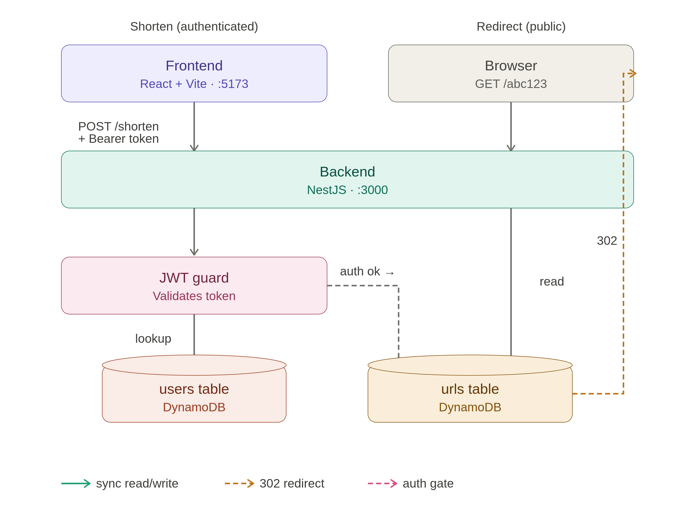

# URL Shortener

**Jump to:** [Quick Start](#quick-start) · [Services](#services) · [Architecture](#architecture) · [Design choices](#design-choices) · [API](#api) · [Schema](#schema) · [Testing](#testing) · [Deploy plan](#deploy-plan-aws)

Production-style URL shortener monorepo. React frontend, NestJS API, DynamoDB.

## Quick Start

Requires **[mise](https://mise.jdx.dev)** (manages Node), **Docker**, and **make**. The committed `services/backend/mise.toml` pins Node 24 and auto-loads `.env`.

```bash
cd services/backend && mise trust && mise install && cd ../..
make install        # once — backend + frontend deps
make init           # .env + DynamoDB Local + tables
make backend        # this shell
make frontend       # another shell
```

Open [http://localhost:5173](http://localhost:5173), sign up, shorten a link. `make` with no args lists every target.

## Services

| Directory | What it is | Docs |
| --- | --- | --- |
| [`services/backend`](services/backend) | NestJS API + DynamoDB access | [README](services/backend/README.md) |
| [`services/frontend`](services/frontend) | React + Vite UI | [README](services/frontend/README.md) |
| [`tests`](tests) | k6 load + canary | [Testing](#testing) |

## Architecture



## Design choices

- **React + shadcn/ui** — chosen for simplicity; no Figma design step.
- **NestJS over Express** — DI + opinionated module layout keeps team code consistent; Express lets every contributor invent their own structure.
- **DynamoDB over Postgres/Mongo + Redis** — single-digit-ms reads, no idle cost, scales without re-sharding. Add DAX if a viral link hot-partitions.
- **Conditional writes, not locks** — code collisions handled with `attribute_not_exists(code)`; rename is a single `TransactWriteItems` (put new + delete old). No app-level locking, no read-modify-write races.
- **Local auth (POC only)** — home-rolled register/login with `salt:hash` SHA-256, JWT in `localStorage`. Production would swap to **Amazon Cognito** for user management (registration, MFA, password reset, federation) with the JWT signing key in **AWS Secrets Manager** and tokens in `HttpOnly` cookies + CSRF tokens.

## API

Base URL `http://localhost:3000`.

| Method   | Path                              | Body                          | Response                          |
| -------- | --------------------------------- | ----------------------------- | --------------------------------- |
| `GET`    | `/health`                         | —                             | `{ status, uptimeSeconds, ... }`  |
| `POST`   | `/auth/register`                  | `{ username, password }`      | `{ token }`                       |
| `POST`   | `/auth/login`                     | `{ username, password }`      | `{ token }`                       |
| `GET`    | `/auth/me`                        | Bearer                        | `{ userId, username, createdAt }` |
| `POST`   | `/url`                            | `{ url, userId, customUrl? }` | `{ shortUrl }`                    |
| `GET`    | `/url?user=:userId`               | —                             | `Url[]`                           |
| `PUT`    | `/url/:code/rename?user=:userId`  | `{ newCode }`                 | `{ shortUrl }`                    |
| `DELETE` | `/url/:code?user=:userId`         | —                             | `204`                             |
| `GET`    | `/:code`                          | —                             | `302 → originUrl`                 |

Validation: `username` 3–20 `[a-zA-Z0-9_]`, `password` 8–64, `customUrl` 1–32 `[a-zA-Z0-9_-]`. Passwords stored as `salt:hash` (16 hex bytes salt, `SHA-256(salt + password)`).

## Schema

- **`urls`** — PK `code`, GSI `user-index` on `userId`. Plus `originUrl`, `createdAt`.
- **`users`** — PK `userId` (UUID v4), GSI `username-index` on `username`. Plus `password`, `createdAt`.

## Testing

| Command | Scope |
| --- | --- |
| `make test` | Backend + frontend unit / integration |
| `make test-e2e` | Backend e2e (boots DDB Local + seeds tables, then runs) |
| `npm --prefix services/frontend run test:e2e` | Playwright (needs running stack) |
| `k6 run tests/redirect-load.js` | Load — 5000 req/s redirects, p95 < 200 ms |
| `k6 run tests/redirect-canary.js` | Canary — single register → create → redirect probe |

Both k6 scripts honour `BASE_URL` and `SEED_COUNT` env overrides.

## Deploy plan (AWS)

> The CDK implementation isn't in this repo yet — the section below captures the intended topology and a cost estimate so it can be re-added when ready.

Four stacks:

| Stack                  | What it would create |
| ---------------------- | -------------------- |
| `UrlShortenerData`     | DynamoDB tables (PAY_PER_REQUEST, PITR, `RETAIN`). |
| `UrlShortenerAuth`     | **Cognito User Pool + App Client** for register/login/MFA. Drops the local password-hash code and the `users` table. JWT signing key in **AWS Secrets Manager**. |
| `UrlShortenerBackend`  | Fargate (0.25 vCPU / 0.5 GB) + ALB in default VPC. Validates Cognito-issued JWTs (no longer signs its own). IAM least-privilege (Get/Put/Delete/Query on the `urls` table only). |
| `UrlShortenerFrontend` | Private S3 + CloudFront (OAC, SPA fallback). Uploads `services/frontend/dist/`. |

The auth swap also flips the frontend storage: tokens move out of `localStorage` into `HttpOnly` cookies issued by Cognito's Hosted UI (or by the backend after the Cognito callback), with CSRF tokens on state-changing requests.

Rough deploy flow (once the stacks exist):

```bash
cd infra && npm install
npx cdk bootstrap aws://<ACCOUNT_ID>/ap-southeast-1   # once per account/region
npx cdk deploy UrlShortenerData UrlShortenerAuth UrlShortenerBackend   # outputs BackendUrl, UserPoolId, ClientId

VITE_API_URL=http://<BackendUrl> VITE_USER_POOL_ID=<id> VITE_CLIENT_ID=<id> \
  npm --prefix ../services/frontend run build
npx cdk deploy UrlShortenerFrontend
```

**Cost (Singapore, idle):**

| Service                              | Monthly  |
| ------------------------------------ | -------- |
| Fargate (0.25 vCPU / 0.5 GB)         | ~$10     |
| ALB                                  | ~$16     |
| DynamoDB on-demand (low)             | <$1      |
| S3 + CloudFront (low, often free)    | <$1      |
| Cognito (first 50k MAU free)         | $0       |
| Secrets Manager + ECR + CloudWatch   | <$2      |
| **Floor**                            | **~$28** |
