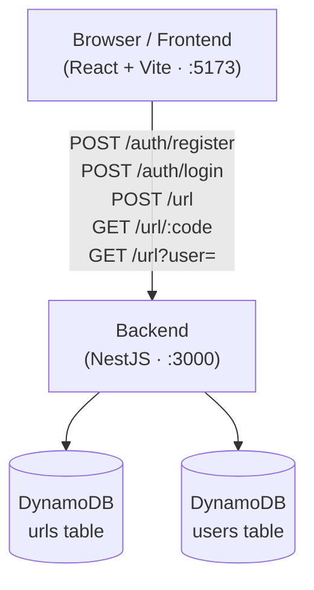
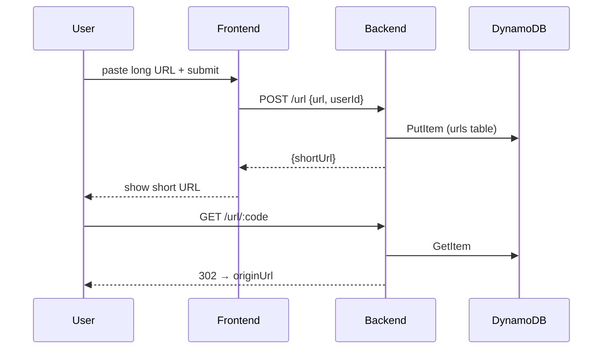
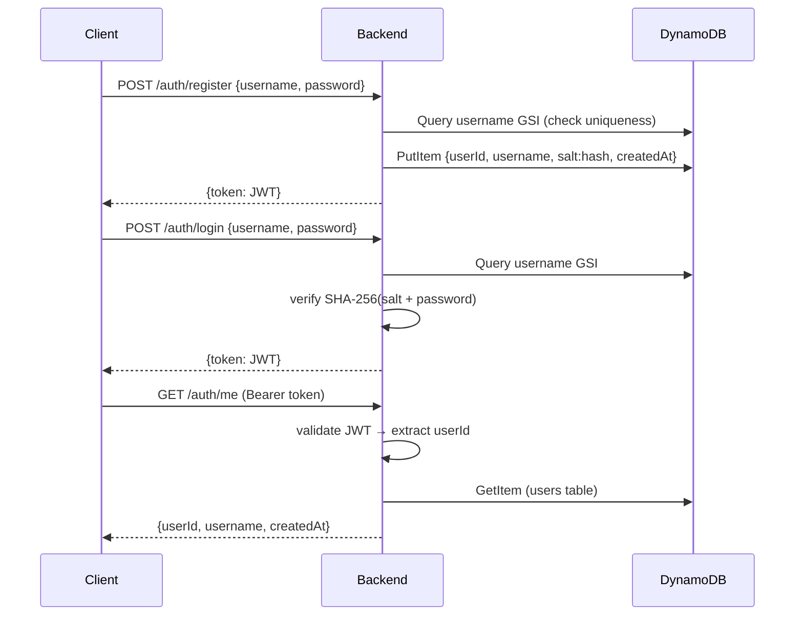

# URL Shortener

A production-style URL shortener monorepo. Shorten long URLs and manage them through a React frontend backed by a NestJS API and DynamoDB.

## Architecture



## Services

| Service | Path | Description |
|---|---|---|
| **backend** | `services/backend` | Auth, URL creation, redirect |
| **frontend** | `services/frontend` | React UI — shorten URLs via the backend API |

## Data flow



## Auth flow



Passwords are stored as `salt:hash` where `salt` is 16 random bytes (hex) and `hash` is `SHA-256(salt + password)`.

## Prerequisites

- [Node.js](https://nodejs.org) ≥ 20
- [Yarn](https://yarnpkg.com) v1
- [Docker](https://www.docker.com) + Docker Compose

## Quick start (Docker)

```bash
cp .env.example .env
# generate a JWT_SECRET and paste it into .env
openssl rand -base64 32
```

**Development** — hot reload, DynamoDB Local on port `8000`:

```bash
docker compose -f docker-compose.dev.yml up --build
```

Services start at:
- Frontend → http://localhost:5173
- Backend API → http://localhost:3000

**Production** — nginx + optimised builds, connects to real AWS DynamoDB:

```bash
docker compose -f docker-compose.prod.yml up --build
```

Services start at:
- Frontend → http://localhost:80
- Backend API → http://localhost:3000

## Local development (without Docker)

### 1. Install dependencies

```bash
yarn install
```

### 2. Start DynamoDB Local

```bash
docker run -p 8000:8000 amazon/dynamodb-local -jar DynamoDBLocal.jar -sharedDb -inMemory
```

### 3. Create tables

```bash
export AWS_ACCESS_KEY_ID=local AWS_SECRET_ACCESS_KEY=local AWS_REGION=ap-southeast-1
export URL_TABLE=urls URL_USER_INDEX=user-index
export USER_TABLE=users USER_USERNAME_INDEX=username-index
DYNAMODB_ENDPOINT=http://localhost:8000 ./scripts/init-dynamo.sh
```

### 4. Copy and fill environment files

```bash
cp services/backend/.env.example services/backend/.env
cp services/frontend/.env.example services/frontend/.env
```

### 5. Start services

```bash
yarn dev:backend    # NestJS watch mode on :3000
yarn dev:frontend   # Vite dev server on :5173
```

## Environment variables

### `services/backend/.env`

| Variable | Example | Description |
|---|---|---|
| `PORT` | `3000` | HTTP port |
| `PUBLIC_BASE_URL` | `http://localhost:3000` | Base URL prepended to short codes |
| `FRONTEND_URL` | `http://localhost:5173` | Used for CORS |
| `AWS_REGION` | `ap-southeast-1` | |
| `AWS_ENDPOINT` | `http://localhost:8000` | DynamoDB Local endpoint (omit in prod) |
| `AWS_ACCESS_KEY_ID` | `local` | |
| `AWS_SECRET_ACCESS_KEY` | `local` | |
| `URL_TABLE` | `urls` | DynamoDB table name |
| `URL_USER_INDEX` | `user-index` | GSI for listing URLs by user |
| `USER_TABLE` | `users` | DynamoDB table name |
| `USER_USERNAME_INDEX` | `username-index` | GSI for username lookup |
| `JWT_SECRET` | `dev-secret-change-me` | **Change in production** |
| `JWT_EXPIRES_IN` | `7d` | Token TTL |

### `services/frontend/.env`

| Variable | Example | Description |
|---|---|---|
| `VITE_API_URL` | `http://localhost:3000` | Backend API base URL |

## API reference

### Auth

| Method | Path | Body | Response |
|---|---|---|---|
| `POST` | `/auth/register` | `{ username, password }` | `{ token }` |
| `POST` | `/auth/login` | `{ username, password }` | `{ token }` |
| `GET` | `/auth/me` | — (Bearer token) | `{ userId, username, createdAt }` |

**Validation rules**
- `username`: 3–20 chars, `[a-zA-Z0-9_]` only
- `password`: 8–64 chars

### URLs

| Method | Path | Body / Query | Response |
|---|---|---|---|
| `POST` | `/url` | `{ url, userId, customUrl? }` | `{ shortUrl }` |
| `GET` | `/url/:code` | — | `302` redirect |
| `GET` | `/url?user=:userId` | `user` (UUID) | `Url[]` |

## DynamoDB schema

### `urls` table

| Attribute | Type | Key |
|---|---|---|
| `code` | String | PK |
| `userId` | String | GSI PK (`user-index`) |
| `originUrl` | String | |
| `createdAt` | String (ISO 8601) | |

### `users` table

| Attribute | Type | Key |
|---|---|---|
| `userId` | String (UUID v4) | PK |
| `username` | String | GSI PK (`username-index`) |
| `password` | String (`salt:hash`) | |
| `createdAt` | String (ISO 8601) | |

## Testing

### Unit + integration (no external services)

```bash
yarn test:backend    # NestJS unit + integration
yarn test:frontend   # Vitest unit + component
```

### E2E — backend (no external services)

The e2e suite uses an in-memory DynamoDB stub — no running database required.

```bash
yarn test:backend:e2e
```

### E2E — frontend (Playwright, requires the full stack)

Start DynamoDB Local and the backend first, then run Playwright:

```bash
# Terminal 1 — spin up DynamoDB Local with tables pre-created
docker compose -f docker-compose.dev.yml up dynamodb-local dynamodb-init

# Terminal 2 — start the backend pointing at it
yarn dev:backend

# Terminal 3 — run Playwright
yarn workspace url-shortener-frontend test:e2e
```
