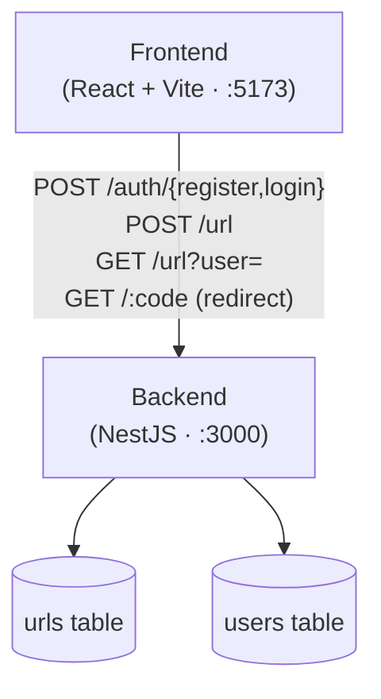

# URL Shortener

A production-style URL shortener monorepo. Shorten long URLs and manage them through a React frontend backed by a NestJS API and DynamoDB.

## Get it running

Needs **Node ≥ 20** and **Docker**.

```bash
# 1. Frontend deps
npm --prefix services/frontend install

# 2. Backend .env
cp services/backend/.env.example services/backend/.env

# 3. Backend + DynamoDB Local
docker compose -f services/backend/compose.yml --profile dev up --build

# 4. Frontend
npm --prefix services/frontend run dev
```

Open vite url→ sign up → shorten a link.

**Jump to:** [Architecture](#architecture) · [Design choices](#design-choices) · [API](#api) · [Schema](#schema) · [Testing](#testing) · [Deploy](#deploy-to-aws-cdk)

## Architecture



## Design choices

- **React + shadcn/ui** — chosen for simplicity; no Figma design step.
- **NestJS over Express** — DI + opinionated module layout keep code consistent across the team; Express invites per-contributor structure that hurts context-switching.
- **Fargate over Lambda** — bursty traffic with idle gaps would hit Lambda cold starts (even with a lambdalith). Fargate stays warm.
- **DynamoDB over Postgres/Mongo + Redis** — less config, lower cost, consistent 4–8 ms latency regardless of item count. Good fit for read-heavy workloads; enable DAX if a viral link >10k QPS creates a hot partition.
- **Local auth over OAuth** — OAuth needs provider app registration (Google etc.), out of scope and belongs in its own service.
- **S3 + CloudFront** — Vite runs natively on the host in dev, prod ships to S3 + CloudFront via CDK (see [Deploy](#deploy-to-aws-cdk)). Redirect requests still hit the backend, which keeps the door open for analytics.
- **Analytics (future)** — clickstream goes to Kinesis Firehose → Parquet in S3 → Athena, not through the app service.

## API

Base URL `http://localhost:3000`. Authenticated endpoints take `Authorization: Bearer <token>`.

| Method | Path                | Body / Header                 | Response                            |
| ------ | ------------------- | ----------------------------- | ----------------------------------- |
| `GET`  | `/health`           | —                             | `{ status, uptimeSeconds, ... }`    |
| `POST` | `/auth/register`    | `{ username, password }`      | `{ token }`                         |
| `POST` | `/auth/login`       | `{ username, password }`      | `{ token }`                         |
| `GET`  | `/auth/me`          | Bearer                        | `{ userId, username, createdAt }`   |
| `POST` | `/url`              | `{ url, userId, customUrl? }` | `{ shortUrl }`                      |
| `GET`  | `/url?user=:userId` | —                             | `Url[]`                             |
| `GET`  | `/:code`            | —                             | `302 → originUrl` (short link)      |

Validation: `username` 3–20 `[a-zA-Z0-9_]`, `password` 8–64, `customUrl` 1–32 `[a-zA-Z0-9_-]`. Passwords stored as `salt:hash` (`salt` = 16 hex bytes, `hash` = `SHA-256(salt + password)`).

## Schema

- **`urls`** — PK `code`, GSI `user-index` on `userId`. Plus `originUrl`, `createdAt`.
- **`users`** — PK `userId` (UUID v4), GSI `username-index` on `username`. Plus `password`, `createdAt`.

## Environment

Backend reads `services/backend/.env` (template: [`.env.example`](services/backend/.env.example)). Compose overrides `AWS_ENDPOINT` to `dynamodb-local:8000`, so the same file works dockerised or not. Frontend uses only `VITE_API_URL`.

## Testing

| Command                    | Scope                              |
| -------------------------- | ---------------------------------- |
| `npm run test:backend`     | NestJS unit + integration          |
| `npm run test:backend:e2e` | Backend e2e (in-memory DDB stub)   |
| `npm run test:frontend`    | Vitest unit + component            |
| `npm run test:load`        | k6 load test (needs running stack) |

Frontend e2e: `npm --prefix services/frontend run test:e2e` against a running stack.

**Load test** ([`tests/redirect-load.js`](tests/redirect-load.js)) ramps redirects to 5000 req/s with a 20 req/s writer, p95 < 200 ms, error < 1%. Override with `BASE_URL` / `SEED_COUNT`. **Canary** ([`tests/redirect-canary.js`](tests/redirect-canary.js)) is a single-iteration probe of register → create → redirect; add a `schedule:` trigger to [`canary.yml`](.github/workflows/canary.yml) to wire it to prod.

## Deploy to AWS (CDK)

Three stacks in [`infra/`](infra/):

| Stack                  | What it creates |
| ---------------------- | --------------- |
| `UrlShortenerData`     | DynamoDB tables (PAY_PER_REQUEST, PITR, `RETAIN`). |
| `UrlShortenerBackend`  | Fargate (0.25 vCPU / 0.5 GB) + ALB in default VPC. JWT in Secrets Manager. IAM least-privilege. |
| `UrlShortenerFrontend` | Private S3 + CloudFront (OAC, SPA fallback). Uploads `services/frontend/dist/`. |

```bash
cd infra && npm install
npx cdk bootstrap aws://<ACCOUNT_ID>/ap-southeast-1   # once per account/region
npx cdk deploy UrlShortenerData UrlShortenerBackend   # ~10 min, outputs BackendUrl

export VITE_API_URL=http://<BackendUrl>
npm --prefix ../services/frontend run build
npx cdk deploy UrlShortenerFrontend
```

Redeploy backend: `cdk deploy UrlShortenerBackend`. Tear down: `cdk destroy UrlShortenerFrontend UrlShortenerBackend` (tables are `RETAIN`ed).

**Cost (Singapore, idle):**

| Service                              | Monthly  |
| ------------------------------------ | -------- |
| Fargate (0.25 vCPU / 0.5 GB)         | ~$10     |
| ALB                                  | ~$16     |
| DynamoDB on-demand (low)             | <$1      |
| S3 + CloudFront (low, often free)    | <$1      |
| Secrets Manager + ECR + CloudWatch   | <$2      |
| **Floor**                            | **~$28** |

**Caveats:** plain HTTP on ALB (add ACM + Route53 for prod); single task, no autoscaling; default VPC; tables retained on destroy.
